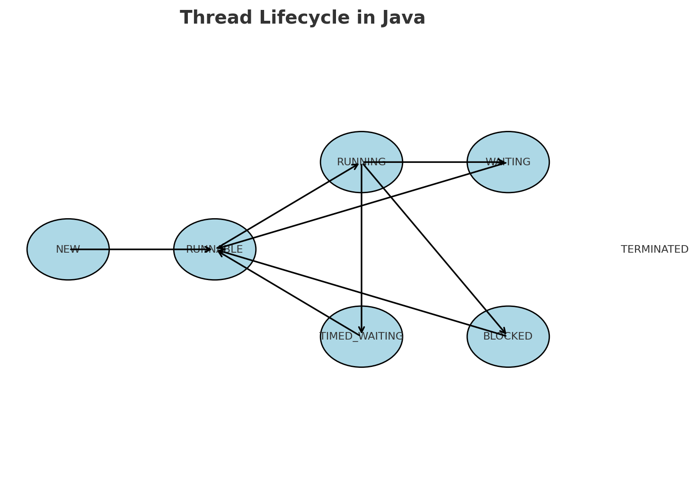
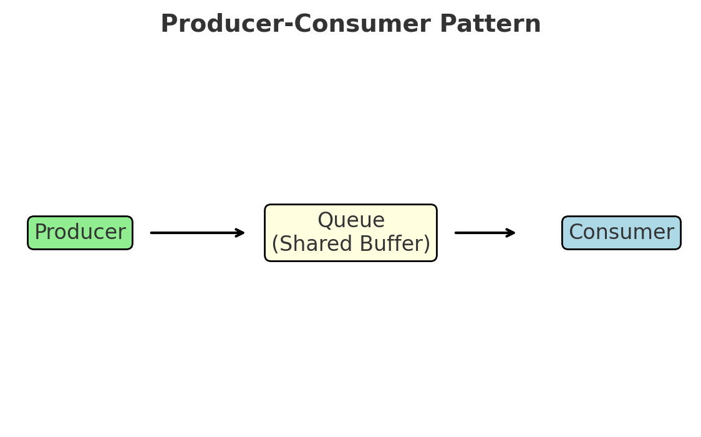
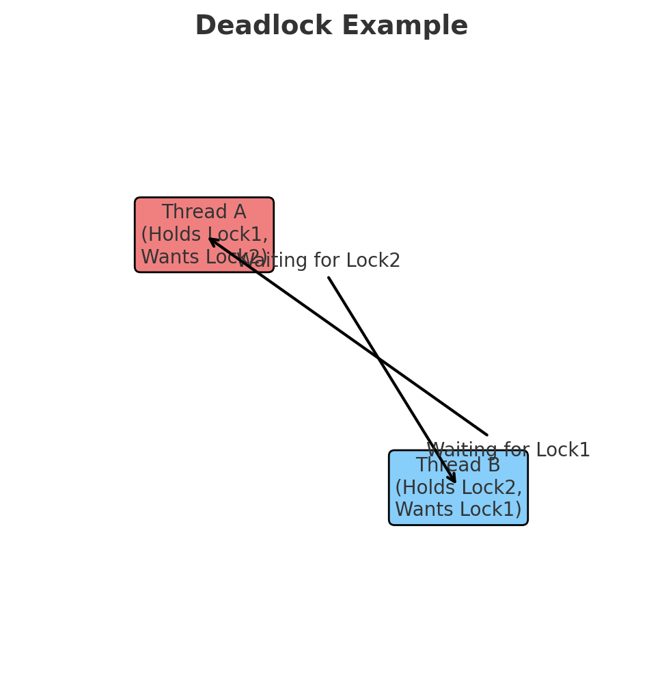

# Java Concurrency and Multithreading

---

## 1. Processes vs Threads

- **Process**: A running program with its own memory (heap).
- **Thread**: A lightweight unit of execution inside a process.

### Memory Layout
```
Process (Application)
 ├── Heap (shared by all threads)
 ├── Thread 1 → own stack
 ├── Thread 2 → own stack
 └── Thread 3 → own stack
```

- Threads share the **heap** (objects, data).
- Each thread has its own **stack** (method calls, local variables).

👉 Benefit: run multiple tasks at once.  
👉 Risk: threads can interfere with each other’s data.

---

## 2. Concurrency

**Concurrency** = doing more than one thing at the same time.

```
Without Concurrency:  [ Task A finishes ] → [ Task B starts ]
With Concurrency:     [ A1 ][ B1 ][ A2 ][ B2 ]  (overlap in progress)
```

- Improves responsiveness.
- Increases performance for multi-tasking programs.
- Common in servers (handle many users at once).

---

## 3. Java Threads

- Threads are represented by the **`Thread` class**.
- Every Java app starts with one **main thread**.
- Additional threads can be created and scheduled to run.

### Thread Priority
- Range: **1 (lowest)** to **10 (highest)**.
- Higher priority threads are *suggested* to run sooner, but JVM/OS decides.

---

## 4. Thread Lifecycle【14†source】【15†source】

Threads go through multiple states:



- **NEW**: Created, not started.
- **RUNNABLE**: Ready to run.
- **RUNNING**: Actively executing.
- **WAITING / BLOCKED**: Temporarily paused.
- **TERMINATED**: Finished execution.

👉 Key difference:
- `run()` → executes in current thread.
- `start()` → creates a new thread (true concurrency).

---

## 5. Multithreading and Memory

### How Threads Use Memory
```
Shared Heap
 ├── Object A  ← modified by Thread 1
 ├── Object B  ← read by Thread 2
 └── Object C  ← used by Thread 3
```

- Heap: visible to all threads.
- Stacks: private to each thread.

### Time Slicing
- CPU divides execution time among threads:
```
Time:  | A | B | C | A | B | ...
```
- A thread may pause mid-operation.
- Other threads can “cut in,” causing unpredictable results.

---

## 6. Interleaving & Atomicity

### Interleaving
When multiple threads overlap:
```
Thread A: count = count + 1   (load 5)
Thread B: count = count + 1   (load 5)
Both write back: 6   (should be 7)
```

### Atomicity
- **Atomic** = happens completely or not at all.
- Example: increment (`i++`) is **not atomic** (it breaks into load → add → store).

### Memory Consistency
- Threads may cache variables locally.
- One thread’s update may not be seen by another immediately.

### Volatile
- `volatile` forces read/write from main memory, not caches.
- Ensures visibility but **not** atomicity.

---

## 7. Synchronization

### Why Synchronize?
- Prevents two threads from modifying the same data at once.

### Synchronized Methods
- Only one thread at a time can run a synchronized method on the same object.

### Synchronized Blocks
- Lock only the part of code that needs protection.

### Intrinsic Locks (Monitors)
```
Object
 └── Lock
       ├── Thread A (holding lock)
       └── Thread B (waiting)
```

### Reentrant Locks
- A thread that already owns a lock can reacquire it without blocking itself.

---

## 8. Producer-Consumer & Deadlocks

### Producer-Consumer Pattern
- **Producer**: creates data.
- **Consumer**: processes data.
- Shared queue between them.



- If producer too fast → queue fills.
- If consumer too slow → waits for new items.

### Deadlocks
- Happens when two threads wait for each other forever.



- Thread A holds Lock1, wants Lock2.
- Thread B holds Lock2, wants Lock1.
- Neither can proceed → deadlock.

---

## 9. Thread Challenge

- Create **two threads**:
    - One prints even numbers.
    - One prints odd numbers.
- Start both.
- After a few seconds, interrupt one.

👉 This challenge demonstrates thread creation, execution, and interruption.

---

## 📌 Final Summary

- **Processes**: independent heaps.
- **Threads**: shared heap, private stacks.
- **Concurrency**: overlapping tasks improve responsiveness.
- **Synchronization**: controls access to shared data.
- **Volatile**: ensures visibility, not atomicity.
- **Deadlocks**: threads stuck waiting forever.

```
Concurrency = Speed + Responsiveness
But requires careful handling of shared data.
```
