# Java Concurrency and Multithreading - Complete Guide

## Table of Contents

1. [Introduction to Concurrency](#1-introduction-to-concurrency)
2. [Processes vs Threads](#2-processes-vs-threads)
3. [Java Thread Basics](#3-java-thread-basics)
4. [Creating Threads](#4-creating-threads)
5. [Thread States and Lifecycle](#5-thread-states-and-lifecycle)
6. [Memory Model and Synchronization Issues](#6-memory-model-and-synchronization-issues)
7. [Synchronization Mechanisms](#7-synchronization-mechanisms)
8. [Advanced Synchronization](#8-advanced-synchronization)
9. [Producer-Consumer Pattern](#9-producer-consumer-pattern)
10. [ExecutorService and Thread Pools](#10-executorservice-and-thread-pools)
11. [Callable and Future](#11-callable-and-future)
12. [Fork-Join Framework](#12-fork-join-framework)
13. [Concurrent Collections](#13-concurrent-collections)
14. [Atomic Operations](#14-atomic-operations)
15. [Locks and Advanced Concurrency](#15-locks-and-advanced-concurrency)
16. [Common Concurrency Problems](#16-common-concurrency-problems)
17. [Parallel Streams](#17-parallel-streams)
18. [Task Scheduling](#18-task-scheduling)
19. [File Watching Service](#19-file-watching-service)
20. [Best Practices](#20-best-practices)

---

## 1. Introduction to Concurrency

### What is Concurrency?
Concurrency refers to an application doing more than one thing at a time. It allows different parts of a program to make progress independently, often leading to better resource utilization and improved performance.

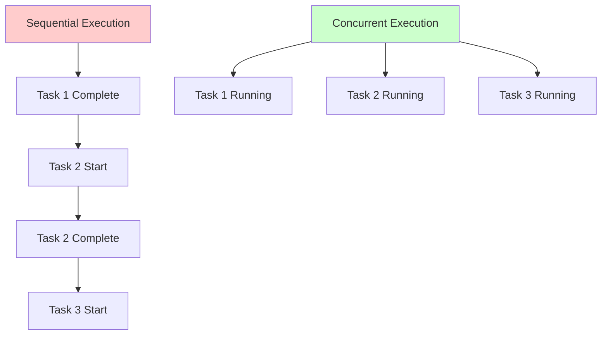

### Why Use Multiple Threads?

| **Purpose** | **Description** | **Example Use Case** |
|-------------|-----------------|---------------------|
| **Long-running tasks** | Offload tasks that take time | File downloads, database operations |
| **Data processing** | Process large datasets | Batch processing, data transformation |
| **Multiple connections** | Handle simultaneous requests | Web servers, chat applications |
| **Resource utilization** | Use multi-core processors efficiently | CPU-intensive calculations |
| **User responsiveness** | Keep UI responsive | Desktop applications, games |

### Key Benefits
- **Better Resource Utilization**: Make use of multiple CPU cores
- **Improved Performance**: Tasks can progress simultaneously
- **Enhanced Responsiveness**: Main thread remains free for user interaction
- **Scalability**: Handle more requests/operations concurrently

---

## 2. Processes vs Threads

### Process Characteristics
- **Independent execution unit** with its own memory space
- **Heap memory is isolated** - processes cannot access each other's memory
- **Heavy resource requirements** for creation and context switching
- **Communication through IPC** (Inter-Process Communication)

### Thread Characteristics
- **Lightweight execution unit** within a process
- **Shared heap memory** among all threads in the same process
- **Individual stack memory** for each thread
- **Lower resource overhead** for creation and management

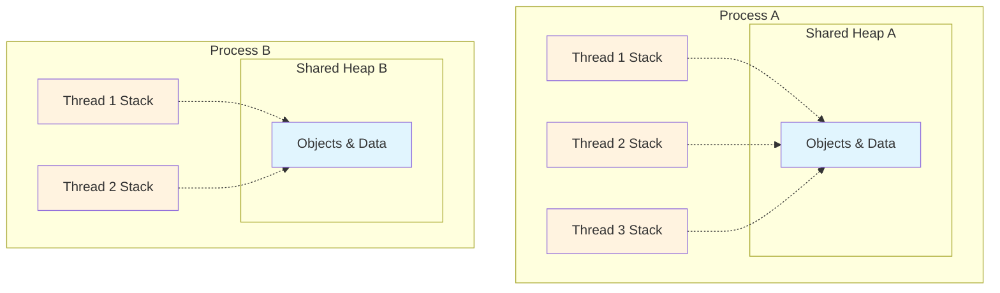

### Memory Structure

| **Memory Type** | **Scope** | **Content** | **Access** |
|-----------------|-----------|-------------|------------|
| **Heap** | Process-wide | Objects, instance variables | Shared among all threads |
| **Stack** | Thread-specific | Local variables, method calls | Private to each thread |
| **Method Area** | Process-wide | Class definitions, constants | Shared among all threads |
| **PC Register** | Thread-specific | Current instruction pointer | Private to each thread |

### Time Slicing
- **Definition**: CPU time divided into small intervals (time slices)
- **Distribution**: Each thread gets a turn to execute
- **Preemption**: Threads must yield when time slice expires
- **Challenges**: Memory state can change during wait periods

---

## 3. Java Thread Basics

### The Thread Class Hierarchy

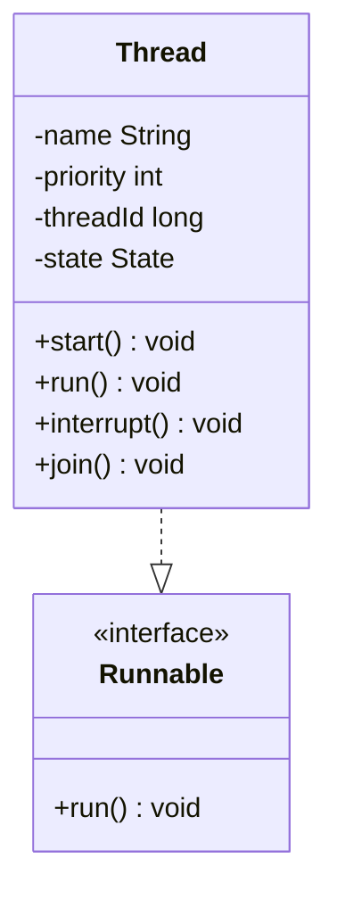

### Thread Properties

| **Property** | **Description** | **Range/Values** | **Default** |
|--------------|-----------------|------------------|-------------|
| **Name** | Thread identifier string | Any string | "Thread-N" |
| **Priority** | Execution priority hint | 1-10 (MIN to MAX) | 5 (NORM) |
| **State** | Current thread state | NEW, RUNNABLE, etc. | NEW |
| **ID** | Unique thread identifier | Long value | Auto-generated |
| **Daemon** | Background thread flag | true/false | false |

### Thread Priority Constants
- `Thread.MIN_PRIORITY = 1` (Low priority)
- `Thread.NORM_PRIORITY = 5` (Default priority)
- `Thread.MAX_PRIORITY = 10` (High priority)

**Important**: Priority is a **suggestion** to the thread scheduler, not a guarantee!

### Native Methods
Some Thread methods use native code (C/C++):
- **Purpose**: Access system-level functionality
- **Reasons**: Platform-specific operations, hardware interface, performance optimization
- **Examples**: `start()`, `interrupt()`, `sleep()`

---

## 4. Creating Threads

### Two Primary Methods

```mermaid
graph TD
    A[Thread Creation] --> B[Extend Thread Class]
    A --> C[Implement Runnable Interface]
    
    B --> D[Override run() method]
    B --> E[Call start() on instance]
    
    C --> F[Implement run() method]
    C --> G[Pass to Thread constructor]
    C --> H[Call start() on Thread]
    
    style B fill:#ffcdd2
    style C fill:#c8e6c9
```

### Method 1: Extending Thread Class

**Advantages:**
- Direct access to Thread methods and properties
- More control over thread behavior
- Can override additional Thread methods

**Disadvantages:**
- Single inheritance limitation (cannot extend other classes)
- Tight coupling to Thread class
- Less flexible design

### Method 2: Implementing Runnable

**Advantages:**
- Can extend other classes (composition over inheritance)
- Loose coupling - better OOP design
- Can use lambda expressions (functional interface)
- Better code reusability and maintenance

**Disadvantages:**
- No direct access to Thread methods
- Need Thread wrapper for execution

### Runnable as Functional Interface
Since Runnable has only one abstract method (`run()`), it's a functional interface:
- **Lambda expressions** supported
- **Method references** can be used
- **Anonymous classes** work well

### Critical Difference: run() vs start()

| **Method** | **Execution** | **Thread Context** | **Concurrency** |
|------------|---------------|-------------------|------------------|
| `run()` | Synchronous | Current thread | No parallelism |
| `start()` | Asynchronous | New thread | True concurrency |

**Remember**: Always call `start()` to achieve true multithreading!

---

## 5. Thread States and Lifecycle

### Thread State Diagram

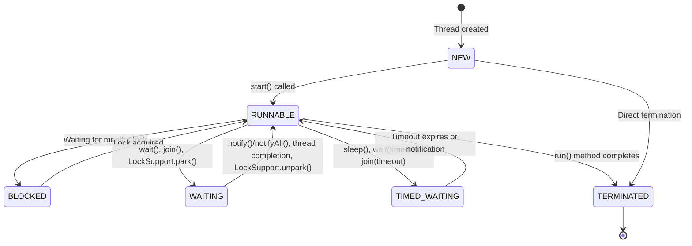

### Thread States Detailed

| **State** | **Description** | **How to Enter** | **How to Exit** |
|-----------|-----------------|------------------|-----------------|
| **NEW** | Thread created but not started | `new Thread()` | `start()` |
| **RUNNABLE** | Executing or ready to execute | `start()`, lock acquired | Block, wait, terminate |
| **BLOCKED** | Waiting for monitor lock | `synchronized` block entry | Lock becomes available |
| **WAITING** | Waiting indefinitely | `wait()`, `join()` | `notify()`, thread completion |
| **TIMED_WAITING** | Waiting for specified time | `sleep()`, `wait(timeout)` | Timeout or notification |
| **TERMINATED** | Execution completed | `run()` method ends | Cannot be restarted |

### State Transition Triggers

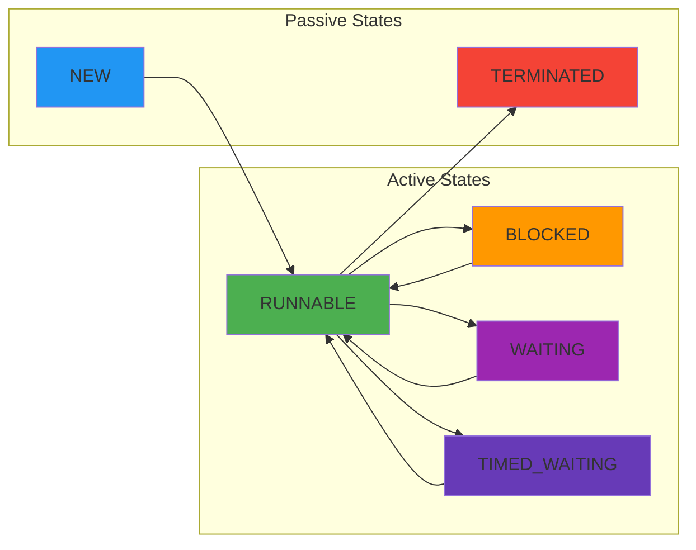

### Thread Lifecycle Methods

| **Method** | **Purpose** | **Effect** | **InterruptedException** |
|------------|-------------|------------|-------------------------|
| `start()` | Begin thread execution | NEW → RUNNABLE | No |
| `sleep(ms)` | Pause execution | RUNNABLE → TIMED_WAITING | Yes |
| `join()` | Wait for thread completion | RUNNABLE → WAITING | Yes |
| `interrupt()` | Signal thread to stop | Sets interrupt flag | No |
| `yield()` | Hint to scheduler | May pause briefly | No |

---

## 6. Memory Model and Synchronization Issues

### Java Memory Model Architecture

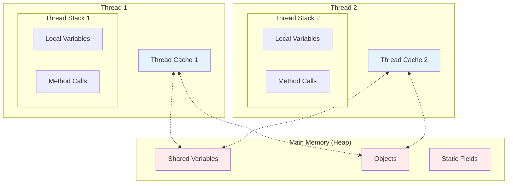

### Memory Consistency Problems

#### 1. Visibility Issues
- **Problem**: Changes in one thread not visible to others
- **Cause**: Values cached in thread-local memory
- **Solution**: `volatile` keyword, synchronization

#### 2. Reordering Issues
- **Problem**: JVM/CPU may reorder instructions for optimization
- **Cause**: Performance optimizations
- **Solution**: Memory barriers, synchronization

#### 3. Atomicity Issues
- **Problem**: Operations that seem atomic actually aren't
- **Examples**: `i++`, `i--`, `long`/`double` assignments
- **Solution**: Synchronized blocks, atomic classes

### Race Conditions

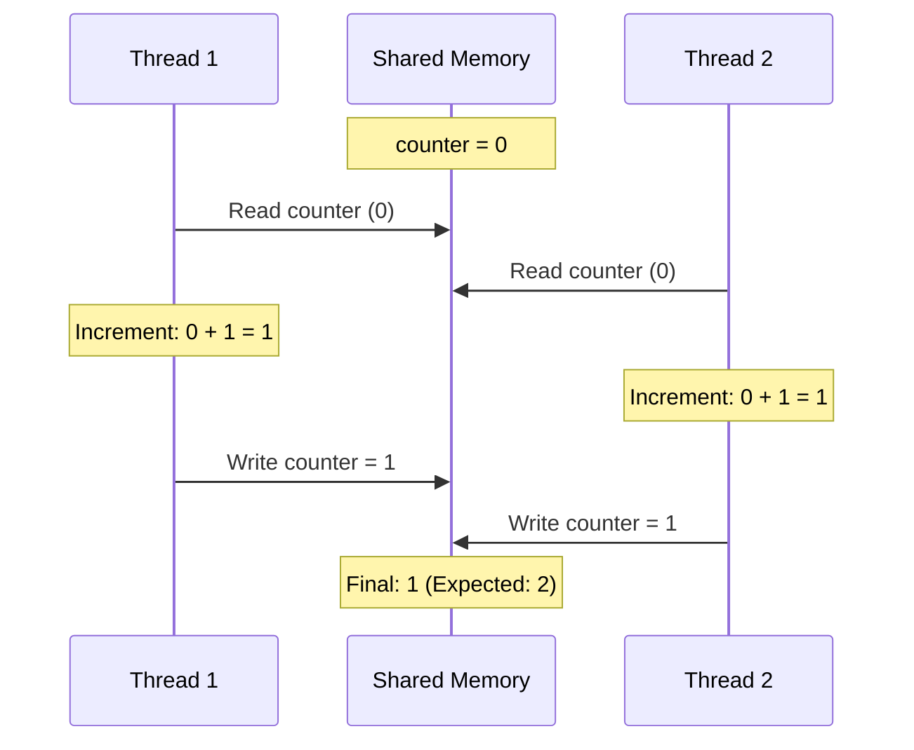

### Atomic vs Non-Atomic Operations

| **Operation Type** | **Examples** | **Thread Safety** | **Solution** |
|-------------------|--------------|-------------------|--------------|
| **Atomic** | `int` assignment, reference assignment | Safe | None needed |
| **Non-Atomic** | `i++`, `i--`, `long`/`double` assignment | Unsafe | Synchronization |
| **Compound** | Read-modify-write operations | Unsafe | Atomic classes |

### The volatile Keyword

**Purpose**: Ensures variable is always read from/written to main memory

**Guarantees**:
- **Visibility**: Changes immediately visible to all threads
- **Ordering**: Prevents reordering around volatile operations
- **Atomicity**: NOT guaranteed for compound operations

**When to Use**:
- Status flags between threads
- Single writer, multiple readers
- Double-checked locking patterns

**When NOT to Use**:
- Multiple writers scenario
- Compound operations like `i++`
- Large data structures (performance impact)

### Memory Barriers
- **Purpose**: Control instruction reordering
- **Types**: Load barriers, store barriers, full barriers
- **Implementation**: Automatic with `volatile` and synchronization

---

## 7. Synchronization Mechanisms

### Monitor Lock (Intrinsic Lock)

Every Java object has a built-in monitor lock:

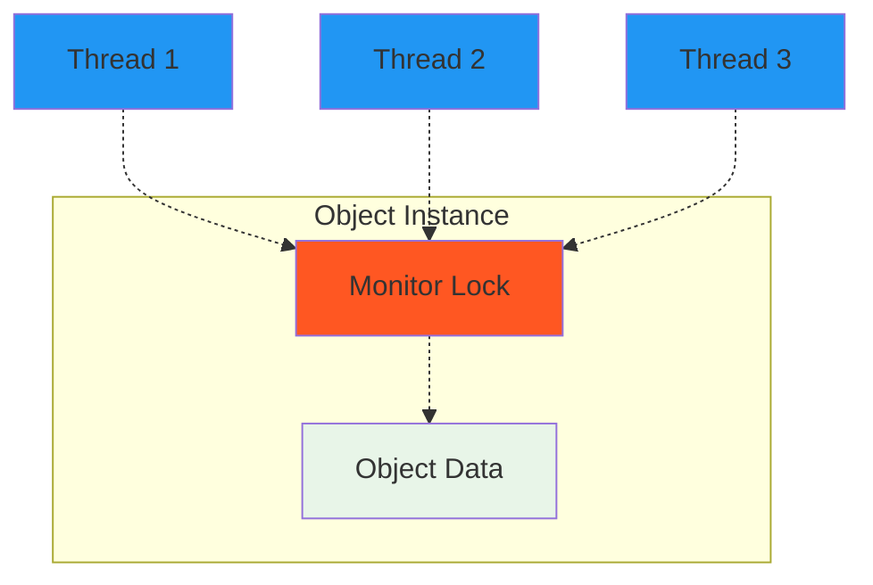

### Synchronized Methods vs Blocks

| **Aspect** | **Synchronized Methods** | **Synchronized Blocks** |
|------------|-------------------------|-------------------------|
| **Scope** | Entire method | Specific code section |
| **Lock Object** | `this` (instance methods) | Specified object |
| **Granularity** | Coarse-grained | Fine-grained |
| **Performance** | May block more than needed | Better performance |
| **Flexibility** | Less flexible | More control |

### Reentrant Synchronization

**Definition**: A thread can acquire the same lock multiple times

**Benefits**:
- Prevents self-deadlock
- Allows method calls within synchronized context
- Built into Java's monitor mechanism

**Hold Count**: Tracks how many times a thread has acquired the lock

```mermaid
graph LR
    A[methodA() acquires lock] --> B[calls methodB()]
    B --> C[methodB() reacquires same lock]
    C --> D[methodB() completes, releases once]
    D --> E[methodA() completes, releases finally]
    
    style A fill:#4caf50
    style C fill:#4caf50
    style D fill:#ff9800
    style E fill:#f44336
```

### Critical Section
- **Definition**: Code that accesses shared resources
- **Requirement**: Only one thread should execute at a time
- **Implementation**: Synchronized methods/blocks
- **Goal**: Thread-safe class when all critical sections are synchronized

### Thread Safety Levels

| **Level** | **Description** | **Examples** |
|-----------|-----------------|--------------|
| **Thread-safe** | Safe for concurrent access | `StringBuffer`, `Vector` |
| **Not thread-safe** | Requires external synchronization | `StringBuilder`, `ArrayList` |
| **Immutable** | State cannot change | `String`, `Integer` |
| **Thread-local** | Each thread has own copy | `ThreadLocal` variables |

---

## 8. Advanced Synchronization

### wait(), notify(), and notifyAll()

These methods enable **thread coordination** and **communication**:

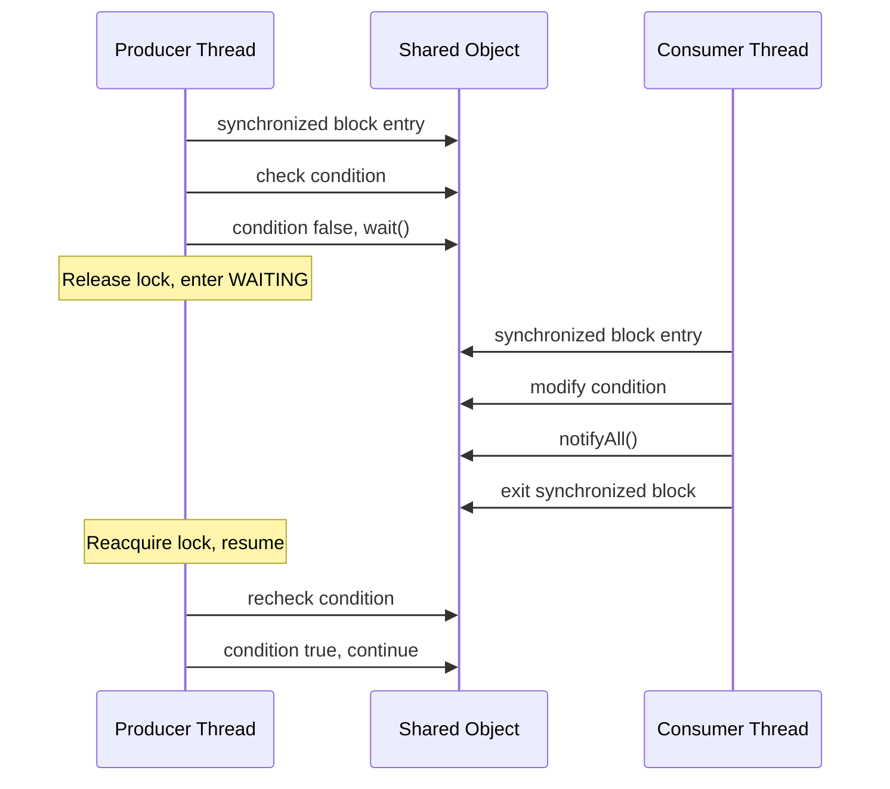

### Wait/Notify Rules

| **Rule** | **Description** | **Violation Result** |
|----------|-----------------|---------------------|
| **Must hold lock** | Call within synchronized context | `IllegalMonitorStateException` |
| **Always in loop** | Recheck condition after waking | Spurious wakeups |
| **Use notifyAll()** | Wake all threads (safer) | Potential missed signals |

### Wait/Notify vs Sleep

| **Aspect** | **wait()** | **sleep()** |
|------------|------------|-------------|
| **Lock behavior** | Releases lock | Keeps lock |
| **Wakeup method** | `notify()`/`notifyAll()` | Time expiration |
| **Purpose** | Thread coordination | Pause execution |
| **Class** | Object method | Thread method |

### Spurious Wakeups
- **Problem**: Thread may wake up without notification
- **Cause**: OS-level interruptions, JVM implementations
- **Solution**: Always use `wait()` in a `while` loop

---

## 9. Producer-Consumer Pattern

### Pattern Overview

Classic pattern demonstrating thread coordination where:
- **Producer**: Creates/generates data
- **Consumer**: Processes/consumes data
- **Buffer**: Shared storage between producer and consumer

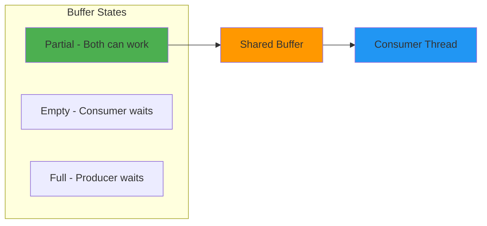

### Synchronization Requirements

| **Condition** | **Thread Action** | **Method Used** |
|---------------|-------------------|-----------------|
| **Buffer Full** | Producer waits | `wait()` |
| **Buffer Empty** | Consumer waits | `wait()` |
| **Item Added** | Notify all | `notifyAll()` |
| **Item Removed** | Notify all | `notifyAll()` |

### Common Implementation Issues

#### 1. Lost Notifications
- **Problem**: Notification sent before thread is waiting
- **Solution**: Always check condition in loop

#### 2. Deadlock Prevention
- **Problem**: All threads waiting, none can proceed
- **Solution**: Proper condition checking and notification

#### 3. Busy Waiting
- **Problem**: Thread continuously checks condition without yielding
- **Solution**: Use `wait()` instead of empty loops

### Producer-Consumer Variants

| **Type** | **Buffer Size** | **Producers** | **Consumers** | **Use Case** |
|----------|-----------------|---------------|---------------|--------------|
| **Single-Single** | Fixed | 1 | 1 | Simple data pipeline |
| **Multi-Multi** | Fixed | Multiple | Multiple | Task processing system |
| **Unbounded** | Unlimited | Multiple | Multiple | Event handling |
| **Priority** | Fixed | Multiple | Multiple | Task scheduling |

---

## 10. ExecutorService and Thread Pools

### Thread Pool Architecture

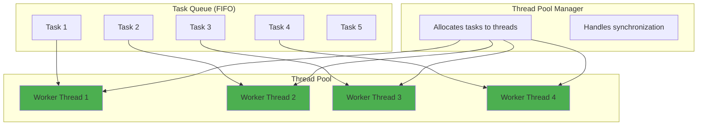

### Why Use Thread Pools?

| **Problem** | **Solution** | **Benefit** |
|-------------|--------------|-------------|
| **Expensive thread creation** | Reuse existing threads | Reduced overhead |
| **Resource management** | Control thread count | Prevent resource exhaustion |
| **Complex thread lifecycle** | Automatic management | Simplified code |
| **Scalability issues** | Configurable pool sizes | Better performance |

### Thread Pool Types

| **Type** | **Characteristics** | **Best For** | **Executors Method** |
|----------|-------------------|--------------|---------------------|
| **FixedThreadPool** | Fixed number of threads | Stable workload | `newFixedThreadPool(n)` |
| **CachedThreadPool** | Creates threads as needed | Variable workload | `newCachedThreadPool()` |
| **SingleThreadExecutor** | One thread only | Sequential processing | `newSingleThreadExecutor()` |
| **ScheduledThreadPool** | Supports scheduling | Periodic tasks | `newScheduledThreadPool(n)` |
| **WorkStealingPool** | Work-stealing algorithm | CPU-intensive tasks | `newWorkStealingPool()` |

### ExecutorService Lifecycle

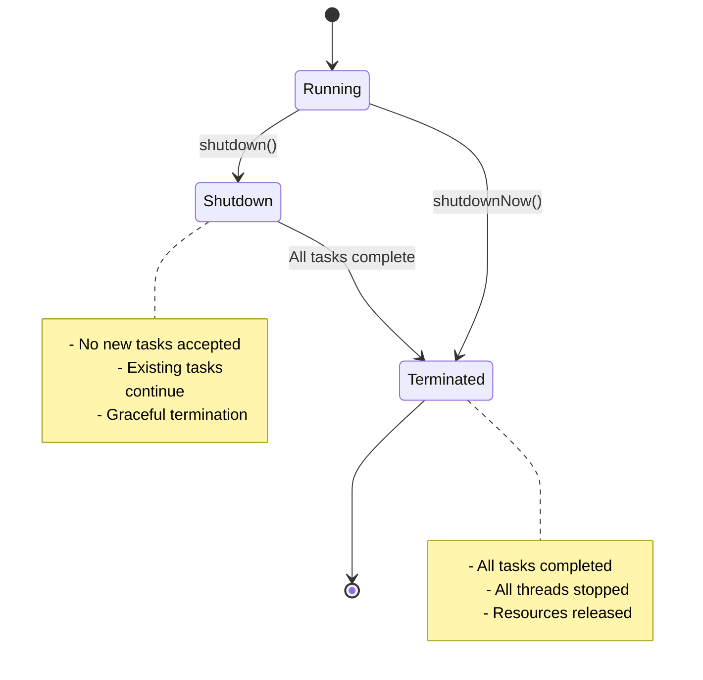

### ExecutorService Methods

| **Method** | **Purpose** | **Behavior** | **Returns** |
|------------|-------------|--------------|-------------|
| `execute(Runnable)` | Submit task without result | Fire and forget | void |
| `submit(Runnable)` | Submit with Future | Can check completion | `Future<?>` |
| `submit(Callable)` | Submit with result | Get return value | `Future<T>` |
| `shutdown()` | Graceful shutdown | Wait for tasks to finish | void |
| `shutdownNow()` | Immediate shutdown | Interrupt running tasks | `List<Runnable>` |

### Best Practices

1. **Always shutdown**: Prevents resource leaks
2. **Use try-with-resources**: Automatic resource management
3. **Choose appropriate pool type**: Based on workload characteristics
4. **Monitor queue sizes**: Prevent memory issues
5. **Handle exceptions**: Use `UncaughtExceptionHandler`

---

## 11. Callable and Future

### Callable vs Runnable Comparison

```mermaid
graph TD
    subgraph "Runnable Interface"
        R1[void run()]
        R2[Cannot throw checked exceptions]
        R3[No return value]
    end
    
    subgraph "Callable Interface"
        C1[V call() throws Exception]
        C2[Can throw checked exceptions]
        C3[Returns typed value]
    end
    
    style R1 fill:#ffcdd2
    style R2 fill:#ffcdd2
    style R3 fill:#ffcdd2
    style C1 fill:#c8e6c9
    style C2 fill:#c8e6c9
    style C3 fill:#c8e6c9
```

### Future Interface

The Future represents the result of an asynchronous computation:

| **Method** | **Purpose** | **Blocking** | **Returns** |
|------------|-------------|--------------|-------------|
| `get()` | Get result | Yes (until completion) | Result value |
| `get(timeout, unit)` | Get result with timeout | Yes (until timeout) | Result or exception |
| `isDone()` | Check completion | No | boolean |
| `cancel(interrupt)` | Cancel task | No | boolean |
| `isCancelled()` | Check if cancelled | No | boolean |

### Future State Diagram

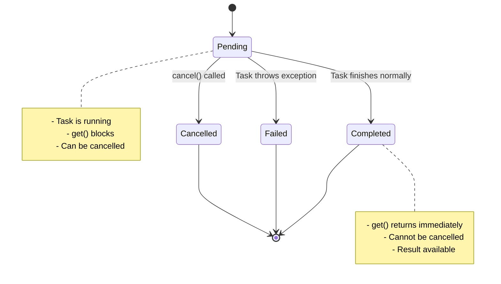

### ExecutorService Submit Methods

| **Method Signature** | **Parameter** | **Return Type** | **Use Case** |
|---------------------|---------------|-----------------|--------------|
| `submit(Runnable task)` | Task without result | `Future<?>` | Track completion |
| `submit(Runnable task, T result)` | Task + result | `Future<T>` | Return preset result |
| `submit(Callable<T> task)` | Task with result | `Future<T>` | Get computed result |

### invokeAll vs invokeAny


| **Aspect** | **invokeAll** | **invokeAny** |
|------------|---------------|---------------|
| **Execution** | All tasks run | All start, first wins |
| **Return** | List of all results | Single result |
| **Completion** | Waits for all | Waits for first |
| **Use Case** | Need all results | Need any valid result |
| **Cancellation** | None | Cancels remaining |

### Future Exception Handling

| **Exception** | **Cause** | **When Thrown** |
|---------------|-----------|-----------------|
| `ExecutionException` | Task threw exception | During `get()` |
| `InterruptedException` | Thread interrupted | During `get()` |
| `TimeoutException` | Timeout exceeded | During `get(timeout)` |
| `CancellationException` | Task was cancelled | During `get()` |

---

## 12. Fork-Join Framework

### Fork-Join Concept

Based on **divide-and-conquer** algorithm:
1. **Fork**: Divide large task into smaller subtasks
2. **Compute**: Process subtasks in parallel
3. **Join**: Combine results from subtasks

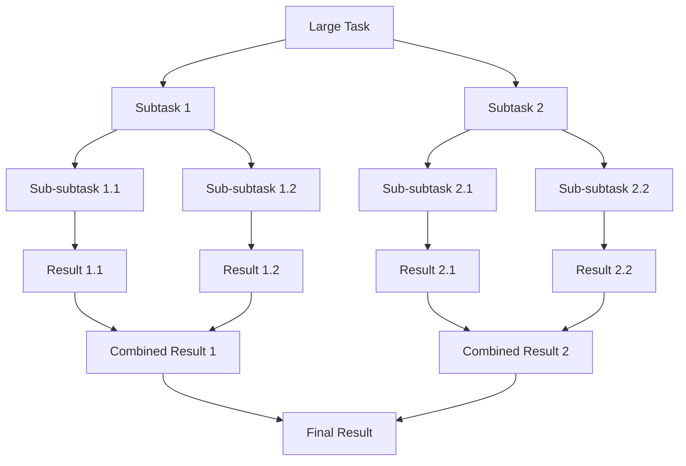

### Work-Stealing Algorithm

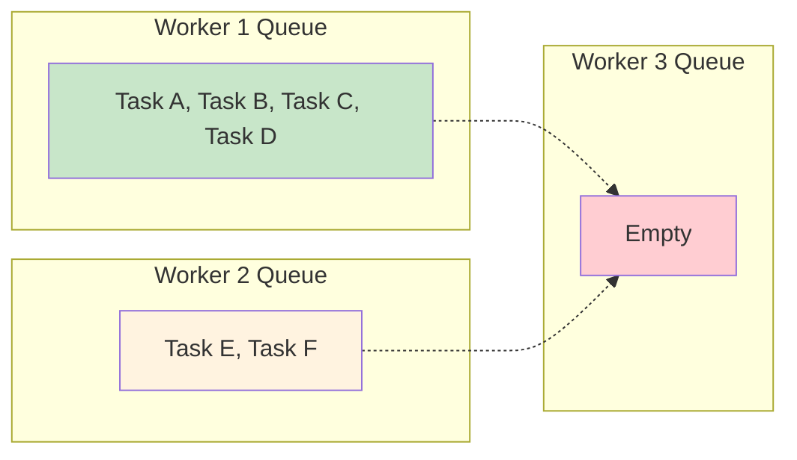

**Benefits of Work Stealing**:
- **Load balancing**: Idle threads help busy threads
- **Reduced idle time**: Better CPU utilization
- **Scalability**: Adapts to different workloads
- **Cache locality**: Tasks often related to stolen work

### ForkJoinTask Types

| **Class** | **Purpose** | **Return Type** | **Use Case** |
|-----------|-------------|-----------------|--------------|
| **RecursiveAction** | Task without result | void | Parallel operations |
| **RecursiveTask<V>** | Task with result | V | Parallel computations |
| **CountedCompleter** | Custom completion actions | void | Complex workflows |

### Fork-Join Best Practices

1. **Use appropriate threshold**: Avoid excessive splitting
2. **Prefer compute() over fork()**: Better for smaller subtasks
3. **Balance workload**: Equal-sized subtasks perform better
4. **Avoid blocking operations**: Can starve other tasks
5. **Use ForkJoinPool.commonPool()**: For general-purpose tasks

### Types of Parallelism

| **Type** | **Description** | **Example** | **Best For** |
|----------|-----------------|-------------|--------------|
| **Task Parallelism** | Different tasks run concurrently | Web request processing | Independent operations |
| **Data Parallelism** | Same operation on different data | Array processing | Homogeneous computations |

---

## 13. Concurrent Collections

### Thread-Safety Approaches

```mermaid
graph TD
    A[Collection Thread-Safety] --> B[Synchronized Wrappers]
    A --> C[Concurrent Collections]
    A --> D[Immutable Collections]
    
    B --> B1[Collections.synchronizedList()]
    B --> B2[Collections.synchronizedMap()]
    B --> B3[Single lock for entire collection]
    
    C --> C1[ConcurrentHashMap]
    C --> C2[CopyOnWriteArrayList]
    C --> C3[Fine-grained locking]
    
    D --> D1[Immutable after creation]
    D --> D2[Thread-safe by nature]
    
    style B fill:#ffcdd2
    style C fill:#c8e6c9
    style D fill:#e1f5fe
```

### Concurrent Collections Overview

| **Collection Type** | **Thread-Safe Options** | **Best Use Case** |
|-------------------|------------------------|-------------------|
| **List** | `CopyOnWriteArrayList`, `Collections.synchronizedList()` | Read-heavy workloads |
| **Set** | `ConcurrentHashMap.newKeySet()`, `Collections.synchronizedSet()` | Unique elements with concurrency |
| **Map** | `ConcurrentHashMap`, `ConcurrentSkipListMap` | Key-value pairs with high concurrency |
| **Queue** | `ArrayBlockingQueue`, `ConcurrentLinkedQueue` | Producer-consumer scenarios |
| **Deque** | `ConcurrentLinkedDeque`, `LinkedBlockingDeque` | Double-ended queue operations |

### ConcurrentHashMap Features

**Advantages over Hashtable/synchronized Map**:
- **Segment-based locking**: Better concurrency
- **Lock-free reads**: Improved performance
- **Atomic operations**: `putIfAbsent()`, `replace()`, `compute()`
- **Parallel operations**: Supports parallel streams

```mermaid
graph TB
    subgraph "Traditional Hashtable"
        TH[Single Lock for Entire Map]
        TH --> THB1[Bucket 1]
        TH --> THB2[Bucket 2]
        TH --> THB3[Bucket 3]
        TH --> THB4[Bucket 4]
    end
    
    subgraph "ConcurrentHashMap"
        CH1[Lock Segment 1] --> CHB1[Bucket 1]
        CH1 --> CHB2[Bucket 2]
        CH2[Lock Segment 2] --> CHB3[Bucket 3]
        CH2 --> CHB4[Bucket 4]
    end
    
    style TH fill:#ffcdd2
    style CH1 fill:#c8e6c9
    style CH2 fill:#c8e6c9
```

### BlockingQueue Types

| **Implementation** | **Capacity** | **Ordering** | **Best For** |
|-------------------|--------------|--------------|--------------|
| **ArrayBlockingQueue** | Fixed | FIFO | Bounded producer-consumer |
| **LinkedBlockingQueue** | Optional bound | FIFO | High throughput scenarios |
| **PriorityBlockingQueue** | Unbounded | Priority-based | Task scheduling |
| **SynchronousQueue** | 0 (direct handoff) | N/A | Thread coordination |
| **DelayQueue** | Unbounded | Delay-based | Scheduled tasks |

### BlockingQueue Operations

| **Operation Type** | **Throws Exception** | **Returns Special Value** | **Blocks** | **Times Out** |
|-------------------|-------------------|------------------------|------------|---------------|
| **Insert** | `add(e)` | `offer(e)` | `put(e)` | `offer(e, time, unit)` |
| **Remove** | `remove()` | `poll()` | `take()` | `poll(time, unit)` |
| **Examine** | `element()` | `peek()` | N/A | N/A |

### CopyOnWriteArrayList

**Mechanism**:
1. **Read operations**: Use original array (no locking)
2. **Write operations**: Create new array copy
3. **Update reference**: Point to new array atomically

**Trade-offs**:
- ✅ **Excellent for read-heavy workloads**
- ✅ **Thread-safe iteration**
- ❌ **Memory intensive for frequent writes**
- ❌ **Performance penalty on modifications**

```mermaid
sequenceDiagram
    participant R as Reader Threads
    participant W as Writer Thread
    participant A1 as Array v1
    participant A2 as Array v2
    
    R->>A1: Read operations
    W->>A1: Copy array
    W->>A2: Modify copy
    W->>A2: Update reference
    R->>A1: Continue reading (old version)
    Note over R,A2: New readers use v2, existing readers finish with v1
```

---

## 14. Atomic Operations

### Atomic Package Overview

The `java.util.concurrent.atomic` package provides **lock-free, thread-safe** operations:

| **Class** | **Purpose** | **Key Methods** |
|-----------|-------------|-----------------|
| **AtomicBoolean** | Atomic boolean operations | `get()`, `set()`, `compareAndSet()` |
| **AtomicInteger** | Atomic integer operations | `incrementAndGet()`, `addAndGet()` |
| **AtomicLong** | Atomic long operations | `decrementAndGet()`, `getAndAdd()` |
| **AtomicReference<V>** | Atomic object reference | `compareAndSet()`, `getAndSet()` |

### Atomic Arrays

| **Array Type** | **Element Operations** | **Use Case** |
|---------------|----------------------|--------------|
| **AtomicIntegerArray** | Atomic int operations | Concurrent counters array |
| **AtomicLongArray** | Atomic long operations | High-precision measurements |
| **AtomicReferenceArray<E>** | Atomic reference operations | Object arrays with concurrency |

### Compare-and-Swap (CAS)

**Mechanism**: Atomically compare current value with expected value, update if match

```mermaid
graph TD
    A[Thread calls compareAndSet(expected, new)] --> B{Current value == expected?}
    B -->|Yes| C[Set to new value]
    B -->|No| D[Return false, no change]
    C --> E[Return true]
    
    style C fill:#c8e6c9
    style D fill:#ffcdd2
```

### Advantages of Atomic Classes

| **Benefit** | **Description** | **Comparison** |
|-------------|-----------------|----------------|
| **Lock-free** | No thread blocking | vs synchronized blocks |
| **High performance** | Better in high-contention scenarios | vs volatile + synchronization |
| **Scalability** | Performance improves with more cores | vs single-threaded bottlenecks |
| **ABA problem resistance** | Detects intermediate changes | vs simple comparison |

### When to Use Atomic Classes

✅ **Use Atomic When**:
- Single variable updates
- High contention scenarios
- Performance is critical
- Simple operations (increment, decrement, compare)

❌ **Don't Use Atomic When**:
- Multiple related variables need coordination
- Complex operations requiring multiple steps
- Low contention scenarios (overhead not worth it)

---

## 15. Locks and Advanced Concurrency

### Lock Interface Advantages

```mermaid
graph TD
    A[Monitor Lock Limitations] --> A1[No timeout capability]
    A --> A2[No interrupt handling]
    A --> A3[Exclusive access only]
    A --> A4[Limited debugging info]
    
    B[Lock Interface Benefits] --> B1[Timeout with tryLock()]
    B --> B2[Interruptible locking]
    B --> B3[Read-write separation]
    B --> B4[Lock state inspection]
    
    style A fill:#ffcdd2
    style B fill:#c8e6c9
```

### Lock Implementations

| **Implementation** | **Features** | **Use Case** |
|-------------------|--------------|--------------|
| **ReentrantLock** | Reentrant, fair/unfair | General-purpose replacement for synchronized |
| **ReentrantReadWriteLock** | Separate read/write locks | Read-heavy scenarios |
| **StampedLock** | Optimistic reading | High-performance read-write scenarios |

### ReentrantLock Features

**Basic Operations**:
- `lock()` - Acquire lock (blocking)
- `tryLock()` - Try to acquire (non-blocking)
- `tryLock(time, unit)` - Try with timeout
- `unlock()` - Release lock
- `lockInterruptibly()` - Acquire but respond to interrupts

**Fairness**:
```mermaid
graph LR
    subgraph "Fair Lock"
        F1[Thread 1] --> FQ[FIFO Queue]
        F2[Thread 2] --> FQ
        F3[Thread 3] --> FQ
        FQ --> FL[Lock Granted in Order]
    end
    
    subgraph "Unfair Lock (Default)"
        U1[Thread 1] --> UL[Lock Available]
        U2[Thread 2] --> UL
        U3[Thread 3] --> UL
        UL --> UG[Any Thread Can Acquire]
    end
    
    style FQ fill:#c8e6c9
    style UL fill:#fff3e0
```

### Read-Write Locks

**Concept**: Multiple threads can read simultaneously, but writes are exclusive

```mermaid
graph TD
    A[ReadWriteLock] --> B[Read Lock]
    A --> C[Write Lock]
    
    B --> D[Multiple readers allowed]
    B --> E[Block if writer active]
    
    C --> F[Exclusive access]
    C --> G[Block all readers and writers]
    
    style B fill:#c8e6c9
    style C fill:#ffcdd2
```

### Lock Hold Count

**Reentrant Lock Tracking**:
- **Initial acquisition**: Hold count = 1
- **Reacquisition**: Hold count increments
- **Release**: Hold count decrements
- **Fully released**: Hold count = 0

**Critical Rule**: Number of `unlock()` calls must match `lock()` calls

### Best Practices with Locks

1. **Always use try-finally**:
   ```
   lock.lock();
   try {
       // Critical section
   } finally {
       lock.unlock();
   }
   ```

2. **Use timeouts to avoid deadlocks**
3. **Prefer unfair locks for performance**
4. **Consider ReadWriteLock for read-heavy scenarios**
5. **Monitor lock contention and hold times**

---

## 16. Common Concurrency Problems

### Problem Categories

```mermaid
graph TD
    A[Concurrency Problems] --> B[Deadlock]
    A --> C[Livelock]  
    A --> D[Starvation]
    A --> E[Race Conditions]
    A --> F[Memory Consistency]
    
    B --> B1[Circular wait for resources]
    C --> C1[Threads continuously react to each other]
    D --> D1[Thread cannot get needed resources]
    E --> E1[Outcome depends on timing]
    F --> F1[Inconsistent view of shared data]
    
    style B fill:#f44336
    style C fill:#ff9800
    style D fill:#ff5722
    style E fill:#e91e63
    style F fill:#9c27b0
```

### Deadlock

**Definition**: Two or more threads blocked forever, waiting for each other

**Classic Example - Dining Philosophers**:
```mermaid
graph TD
    P1[Philosopher 1] --> F1[Fork 1]
    P1 --> F5[Fork 5]
    
    P2[Philosopher 2] --> F1
    P2 --> F2[Fork 2]
    
    P3[Philosopher 3] --> F2  
    P3 --> F3[Fork 3]
    
    P4[Philosopher 4] --> F3
    P4 --> F4[Fork 4]
    
    P5[Philosopher 5] --> F4
    P5 --> F5
    
    style P1 fill:#ffcdd2
    style P2 fill:#ffcdd2
    style P3 fill:#ffcdd2
    style P4 fill:#ffcdd2
    style P5 fill:#ffcdd2
```

**Deadlock Prevention Strategies**:

| **Strategy** | **Description** | **Implementation** |
|--------------|-----------------|-------------------|
| **Lock Ordering** | Always acquire locks in same order | Use consistent lock hierarchy |
| **Timeout** | Don't wait indefinitely | Use `tryLock(timeout)` |
| **Deadlock Detection** | Monitor for circular waits | Use tools or algorithms |
| **Avoidance** | Prevent unsafe states | Banker's algorithm |

### Livelock

**Definition**: Threads continuously change state in response to each other, making no progress

**Example Scenario**: Two people in hallway trying to pass each other
```mermaid
sequenceDiagram
    participant A as Person A
    participant B as Person B
    
    A->>A: Move left
    B->>B: Move left  
    Note over A,B: Both moved same direction, still blocked
    
    A->>A: Move right
    B->>B: Move right
    Note over A,B: Both moved same direction again, still blocked
    
    A->>A: Move left
    B->>B: Move left
    Note over A,B: Pattern repeats infinitely...
```

**Livelock Prevention**:
- **Randomization**: Add random delays
- **Prioritization**: Give one thread priority
- **Timeouts**: Break the cycle after time limit

### Starvation

**Definition**: Thread unable to obtain resources it needs to execute

**Causes**:
- **Unfair scheduling**: High-priority threads dominate
- **Resource hogging**: Some threads hold resources too long
- **Poor algorithm design**: Some threads never get chance

**Solutions**:
- **Fair locks**: Use `ReentrantLock(true)`
- **Priority inversion protection**: Boost blocked thread priority
- **Resource quotas**: Limit resource usage per thread

### Summary of Problems

| **Problem** | **Progress Made** | **Detection** | **Recovery** |
|-------------|------------------|---------------|--------------|
| **Deadlock** | None | Lock dependency graphs | Thread restart |
| **Livelock** | None | Repeated state changes | Pattern breaking |
| **Starvation** | Some threads | Resource usage monitoring | Fair scheduling |
| **Race Condition** | Unpredictable | Timing-dependent bugs | Synchronization |

---

## 17. Parallel Streams

### Parallel Stream Architecture

```mermaid
graph TD
    A[Stream Data] --> B[ForkJoinPool]
    B --> C[Worker Thread 1]
    B --> D[Worker Thread 2]
    B --> E[Worker Thread 3]
    B --> F[Worker Thread 4]
    
    C --> G[Process Chunk 1]
    D --> H[Process Chunk 2]
    E --> I[Process Chunk 3]
    F --> J[Process Chunk 4]
    
    G --> K[Combine Results]
    H --> K
    I --> K
    J --> K
    
    style B fill:#2196f3
    style K fill:#4caf50
```

### When Parallel Streams Help

✅ **Good Candidates**:
- **Large datasets** (thousands+ elements)
- **CPU-intensive operations** (complex computations)
- **Independent operations** (no shared state)
- **Multi-core systems available**

❌ **Poor Candidates**:
- **Small datasets** (overhead exceeds benefit)
- **I/O operations** (blocking reduces parallelism)
- **Sequential dependencies** (order matters)
- **Shared mutable state** (synchronization overhead)

### Performance Considerations

| **Factor** | **Impact on Performance** | **Recommendation** |
|------------|--------------------------|-------------------|
| **Data Size** | Larger = better parallelism | Use parallel for 10,000+ elements |
| **Operation Cost** | Complex ops benefit more | Simple ops may be slower parallel |
| **Data Structure** | ArrayList > LinkedList | Choose splittable structures |
| **Core Count** | More cores = better speedup | Monitor CPU utilization |

### Parallel Stream Pitfalls

1. **Thread Safety**: Operations must be thread-safe
2. **Ordering**: May not preserve original order
3. **Debugging**: Harder to debug parallel execution
4. **Resource Usage**: May consume more memory
5. **Blocking Operations**: I/O can reduce effectiveness

### Collectors and Parallel Streams

| **Collector Type** | **Thread Safety** | **Parallel Efficiency** |
|-------------------|-------------------|------------------------|
| **groupingBy()** | Safe | High |
| **groupingByConcurrent()** | Safe | Very High |
| **toList()** | Safe | Medium |
| **reducing()** | Safe | High |
| **Custom collectors** | Depends on implementation | Varies |

---

## 18. Task Scheduling

### ScheduledExecutorService

**Purpose**: Execute tasks at specified times or intervals

```mermaid
timeline
    title Scheduled Task Execution
    
    Now : Initial Schedule
    +2s : schedule() - One-time task
    +5s : scheduleAtFixedRate() - Periodic start
    +10s : scheduleWithFixedDelay() - After completion
    +15s : Next fixed rate execution
    +18s : Next fixed delay execution
```

### Scheduling Methods

| **Method** | **Execution** | **Timing** | **Use Case** |
|------------|---------------|------------|--------------|
| `schedule(task, delay, unit)` | One-time | After delay | Delayed execution |
| `scheduleAtFixedRate(task, initial, period, unit)` | Periodic | Fixed intervals | Regular monitoring |
| `scheduleWithFixedDelay(task, initial, delay, unit)` | Periodic | After completion + delay | Rate-limited processing |

### Fixed Rate vs Fixed Delay

```mermaid
gantt
    title Task Scheduling Comparison
    dateFormat X
    axisFormat %s
    
    section Fixed Rate (every 3s)
    Task 1 : 0, 2
    Task 2 : 3, 5  
    Task 3 : 6, 8
    Task 4 : 9, 11
    
    section Fixed Delay (3s after completion)
    Task 1 : 0, 2
    Task 2 : 5, 7
    Task 3 : 10, 12
    Task 4 : 15, 17
```

### Scheduling Best Practices

1. **Handle exceptions**: Prevent task cancellation
2. **Monitor execution time**: Avoid overlap in fixed-rate tasks
3. **Use appropriate method**: Rate vs delay based on needs
4. **Shutdown properly**: Cancel scheduled tasks
5. **Consider time zones**: For date-based scheduling

---

## 19. File Watching Service

### WatchService Architecture

```mermaid
graph TD
    A[File System] --> B[WatchService]
    B --> C[WatchKey 1]
    B --> D[WatchKey 2]
    B --> E[WatchKey 3]
    
    C --> F[Directory 1 Events]
    D --> G[Directory 2 Events]  
    E --> H[Directory 3 Events]
    
    I[Consumer Thread] --> J[poll() / take()]
    J --> B
    
    style B fill:#2196f3
    style I fill:#4caf50
```

### WatchKey States

```mermaid
stateDiagram-v2
    [*] --> Ready
    Ready --> Signalled : Event detected
    Signalled --> Ready : reset() called
    Ready --> Invalid : Directory deleted/unmounted
    Signalled --> Invalid : Directory deleted/unmounted
    Invalid --> [*]
    
    note right of Ready
        - Key is ready to detect events
        - No events pending
    end note
    
    note right of Signalled  
        - Events are queued
        - Key can be polled
        - Remains signalled until reset
    end note
```

### Event Types

| **Event Type** | **Description** | **When Triggered** |
|---------------|-----------------|-------------------|
| `ENTRY_CREATE` | File/directory created | New file appears |
| `ENTRY_MODIFY` | File/directory modified | Content changes |
| `ENTRY_DELETE` | File/directory deleted | File removed |
| `OVERFLOW` | Events lost | Too many events |

### WatchService Operations

| **Method** | **Behavior** | **Returns** | **Use Case** |
|------------|--------------|-------------|--------------|
| `poll()` | Non-blocking check | WatchKey or null | Periodic checking |
| `poll(timeout, unit)` | Wait with timeout | WatchKey or null | Responsive checking |
| `take()` | Block until event | WatchKey | Event-driven processing |

### Use Cases

- **Development tools**: Auto-compile on file changes
- **File synchronization**: Mirror directory changes
- **Security monitoring**: Detect unauthorized file access
- **Cache invalidation**: Clear cache when files change
- **Backup systems**: Incremental backup triggers

---

## 20. Best Practices

### Thread Safety Guidelines

```mermaid
graph TD
    A[Thread Safety Strategy] --> B[Immutable Objects]
    A --> C[Synchronization] 
    A --> D[Thread-Local Storage]
    A --> E[Concurrent Collections]
    A --> F[Atomic Operations]
    
    B --> B1[No mutable state]
    C --> C1[synchronized, locks]
    D --> D1[ThreadLocal variables]
    E --> E1[ConcurrentHashMap, etc.]
    F --> F1[AtomicInteger, etc.]
    
    style B fill:#c8e6c9
    style C fill:#fff3e0
    style D fill:#e3f2fd
    style E fill:#fce4ec
    style F fill:#f3e5f5
```

### Performance Guidelines

| **Principle** | **Implementation** | **Benefit** |
|---------------|-------------------|-------------|
| **Minimize lock scope** | Use synchronized blocks vs methods | Reduced contention |
| **Prefer concurrent collections** | ConcurrentHashMap vs synchronized Map | Better performance |
| **Use thread pools** | ExecutorService vs new Thread() | Resource efficiency |
| **Avoid busy waiting** | Use wait/notify vs loops | CPU efficiency |
| **Consider lock-free alternatives** | Atomic classes vs synchronization | Higher throughput |

### Memory Management

1. **Avoid memory leaks**: Properly shutdown thread pools
2. **ThreadLocal cleanup**: Remove values when done
3. **Monitor thread count**: Prevent thread exhaustion
4. **Use appropriate collection sizes**: Avoid excessive memory usage

### Debugging Tips

| **Problem** | **Detection Method** | **Tools** |
|-------------|---------------------|-----------|
| **Deadlocks** | Thread dumps, stack traces | JVisualVM, JConsole |
| **High contention** | Lock monitoring | JProfiler, Java Mission Control |
| **Memory leaks** | Heap analysis | Eclipse MAT, JProfiler |
| **Performance issues** | CPU profiling | YourKit, Async Profiler |

### Common Anti-Patterns to Avoid

❌ **Don't Do**:
- Call `run()` instead of `start()`
- Use `stop()`, `suspend()`, `resume()` (deprecated)
- Synchronize on String literals or Boolean objects
- Ignore `InterruptedException`
- Create threads without bounds
- Use busy waiting instead of proper signaling

✅ **Do Instead**:
- Always call `start()` for new threads
- Use interruption and cooperation for thread control
- Synchronize on private final objects
- Handle interrupts appropriately
- Use thread pools with limits
- Use wait/notify or blocking queues

### Testing Concurrent Code

1. **Unit testing**: Test thread-safe classes in isolation
2. **Stress testing**: High load and contention scenarios
3. **Race condition detection**: Tools like FindBugs, SpotBugs
4. **Property-based testing**: Generate concurrent scenarios
5. **Monitoring**: Production monitoring for threading issues

---

## Conclusion

Java concurrency is a complex but essential topic for building scalable, efficient applications. The progression from basic thread concepts to advanced patterns like Fork-Join and concurrent collections provides a comprehensive foundation for handling multi-threaded scenarios.

### Key Takeaways

1. **Start Simple**: Master basic concepts before moving to advanced topics
2. **Choose Right Tools**: ExecutorService often better than manual Thread management
3. **Understand Trade-offs**: Performance vs complexity, memory vs speed
4. **Test Thoroughly**: Concurrent bugs are often timing-dependent
5. **Monitor Production**: Use profiling tools to identify bottlenecks

### Learning Path Recommendation

1. **Foundation**: Threads, synchronization, memory model
2. **Patterns**: Producer-consumer, thread pools
3. **Advanced**: Concurrent collections, atomic operations, locks
4. **Specialized**: Fork-join, parallel streams, custom synchronizers
5. **Production**: Monitoring, debugging, performance tuning

This guide provides a structured approach to mastering Java concurrency, from fundamental concepts to advanced implementations. Practice with real-world scenarios and gradually build complexity as understanding deepens.
